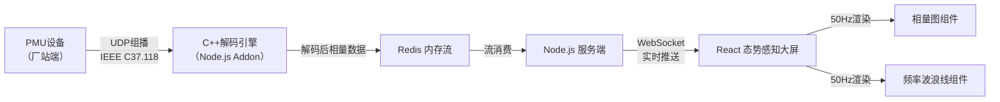
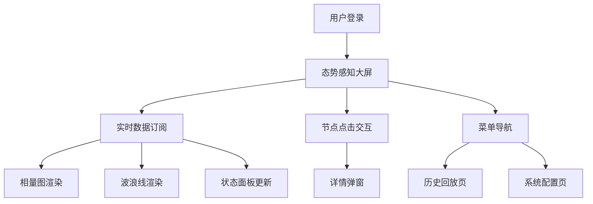

## 1. 产品概述

面向能源电力行业的广域测量系统（WAMS）前后端中控平台，用于实时采集、解码、存储和可视化展示电网同步相量测量单元（PMU）高频数据。

- 核心目标：通过高性能 C++ 解码引擎实现 IEEE C37.118 协议报文的低延迟处理，结合 React 可视化大屏实现电网态势的实时感知与监控
- 目标用户：电网调度中心运行人员、电力系统运维工程师、电网分析决策人员
- 市场价值：解决传统 SCADA 系统刷新率低的痛点，实现毫秒级电网动态态势感知，提升电网安全稳定运行水平

## 2. 核心 Features

### 2.1 User Roles (if applicable)

| 角色 | 注册方式 | 核心权限 |
|------|----------|----------|
| 系统管理员 | 账号密码登录 | 系统配置、数据管理、用户管理 |
| 调度运行人员 | 账号密码登录 | 实时监控、告警查看、历史回放 |
| 分析工程师 | 账号密码登录 | 数据分析、报表导出、参数配置 |

### 2.2 Feature Module

1. **数据采集引擎**：C++ 高性能 UDP 组播侦听、IEEE C37.118 协议解码
2. **数据存储层**：Redis 内存流高速写入、时序数据持久化
3. **数据分发服务**：WebSocket 实时推送、按需订阅机制
4. **态势感知大屏**：极坐标相量图、频率动态波浪线、节点状态面板
5. **系统管理模块**：厂站配置、告警阈值设置、数据回放控制

### 2.3 Page Details

| 页面名称 | 模块名称 | Feature description |
|----------|----------|---------------------|
| 态势感知大屏 | 极坐标相量图 | 50Hz 刷新率平滑转动，展示各节点相角偏移绝对关系，支持节点选中高亮 |
| 态势感知大屏 | 频率动态波浪线 | Canvas 绘制多站点频率偏差曲线，带高光拖尾效果，实时滚动更新 |
| 态势感知大屏 | 节点状态面板 | 展示各厂站 PMU 数据质量、通信状态、电压电流幅值 |
| 态势感知大屏 | 系统概览指标 | 总厂站数、在线率、平均频率、最大相角差等关键指标 |
| 态势感知大屏 | 告警信息栏 | 实时滚动展示越限告警、通信异常、数据异常等信息 |
| 系统配置页 | 厂站管理 | 新增/编辑/删除厂站信息，配置 PMU 参数 |
| 系统配置页 | 协议配置 | 配置 UDP 组播地址、端口、IEEE C37.118 版本参数 |
| 历史回放页 | 数据回放 | 支持指定时间段历史数据回放，倍速播放控制 |

## 3. Core Process

### 3.1 数据采集与处理流程

厂站端 PMU 设备以 50fps 频率通过 UDP 组播发送 IEEE C37.118 二进制报文，C++ 附加组件侦听网络报文并解码为结构化相量数据，写入 Redis 内存流，Node.js 服务通过 WebSocket 向前端推送数据，React 大屏以 50Hz 刷新率渲染相量图和波浪线。

### 3.2 用户访问流程

用户登录系统 → 进入态势感知大屏 → 自动订阅所有厂站实时数据 → 可选择查看特定节点详情 → 可切换至历史回放或系统配置页面

## 4. User Interface Design

### 4.1 Design Style

- **设计基调**：深色系工业科技风，以深邃夜空蓝为底色，配合霓虹青、电力橙、警示红作为高亮色
- **主色调**：#0a0e1a（深空黑）、#0d1526（午夜蓝）、#00f0ff（霓虹青）、#ff6b35（电力橙）
- **辅助色**：#00ff88（运行绿）、#ff3366（告警红）、#ffdd00（预警黄）
- **字体**：
  - 标题：Orbitron（科技感等宽字体）
  - 正文：JetBrains Mono（等宽编程字体，确保数字对齐）
- **按钮样式**：边框发光、悬停时电流波动动画、点击时脉冲反馈
- **布局风格**：网格化布局，固定顶部导航栏 + 左右侧边栏 + 中央主视图区，采用分割线和渐变装饰营造科技感
- **视觉效果**：全局扫描线纹理、边角装饰线、数据流动画、节点脉冲光晕

### 4.2 Page Design Overview

| 页面名称 | 模块名称 | UI Elements |
|----------|----------|-------------|
| 态势感知大屏 | 顶部状态栏 | 系统时间、在线厂站数、告警计数、用户信息，带流光扫描动画 |
| 态势感知大屏 | 左侧节点面板 | 可折叠厂站列表，显示各厂站状态指示灯、相角数值、电压幅值 |
| 态势感知大屏 | 中央相量图 | 圆形极坐标网格，辐射状刻度线，旋转相量箭头带拖尾效果 |
| 态势感知大屏 | 右侧波浪线区域 | 多通道频率波形叠加，Y轴频率偏差、X轴时间轴，高光拖尾 |
| 态势感知大屏 | 底部告警栏 | 横向滚动告警信息，分级配色，支持点击查看详情 |
| 系统配置页 | 配置表单 | 卡片式表单布局，输入框带发光边框，保存按钮带加载动画 |
| 历史回放页 | 时间轴控制 | 拖拽式时间选择器、播放/暂停/倍速控制、进度条波形预览 |

### 4.3 Responsiveness

- 设计原则：Desktop-first，针对 1920×1080 及以上分辨率优化
- 自适应策略：大屏核心区域保持固定比例缩放，侧边栏可自动收起
- 触控优化：关键按钮尺寸 ≥ 48px，支持手势缩放相量图
- 分辨率适配：支持 2K/4K 高分屏，矢量图形确保清晰度

### 4.4 3D Scene Guidance (if applicable)

本项目不涉及 3D 场景，主要使用 Canvas 2D 和 SVG 实现高性能 2D 可视化。
