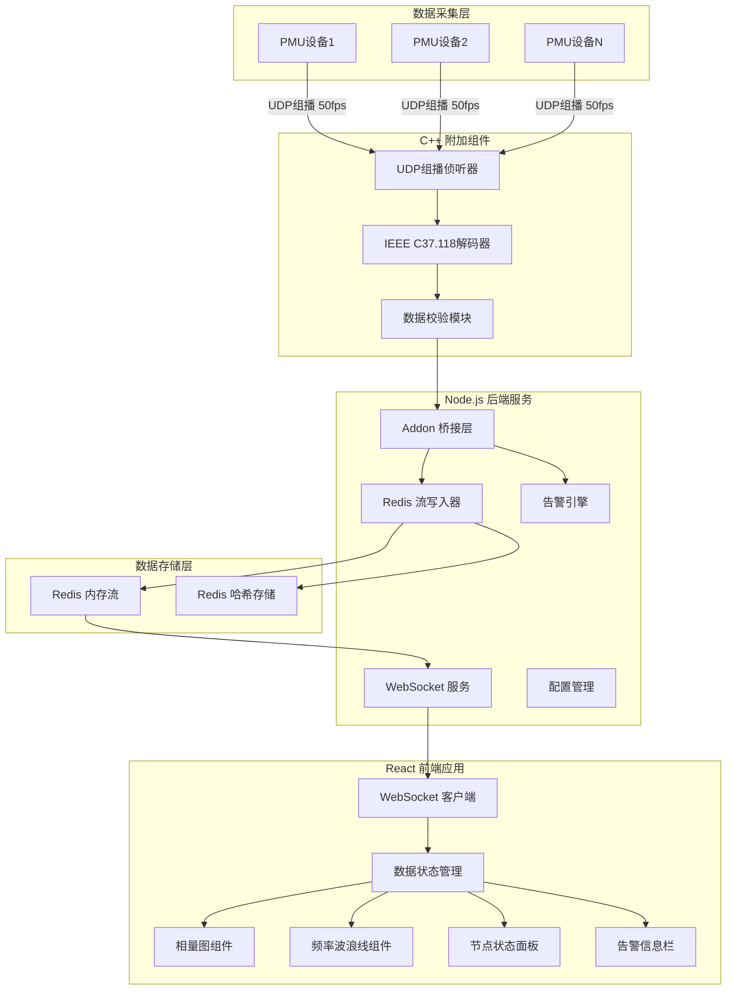
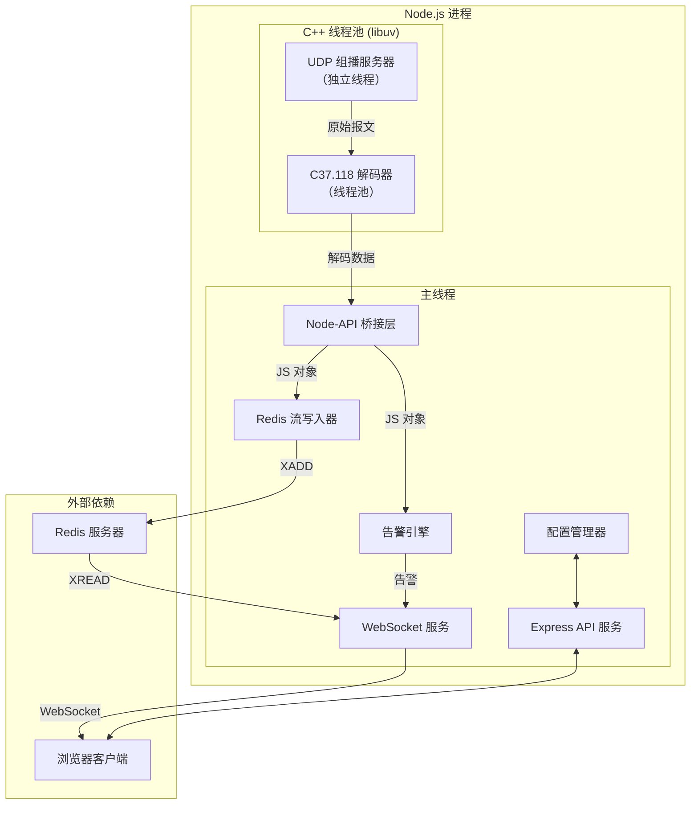
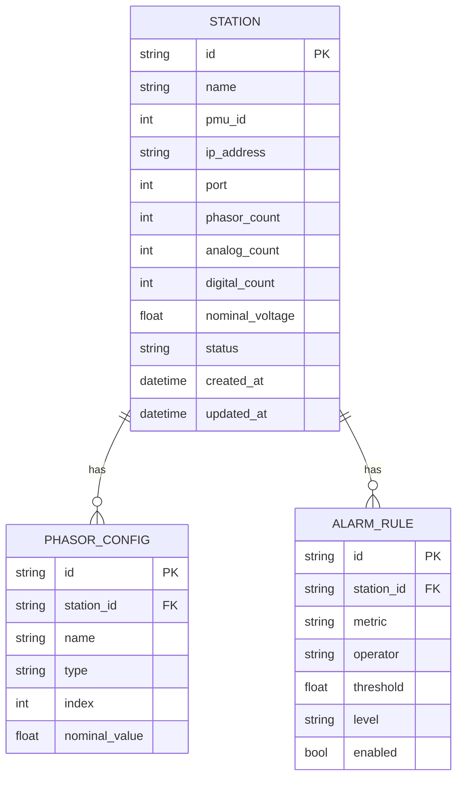

## 1. Architecture Design



## 2. Technology Description

### 2.1 后端技术栈
- **运行时**：Node.js 18+ (LTS)
- **C++ 附加组件**：Node-API (N-API) v8，避免 V8 引擎版本依赖问题
- **网络通信**：原生 UDP Socket (C++)、WebSocket (ws 库)
- **数据存储**：Redis 7.0+，使用 Redis Streams 实现高速数据流
- **Web 框架**：Express 4.x，提供 RESTful API
- **构建工具**：CMake + node-gyp，用于编译 C++ 插件

### 2.2 前端技术栈
- **框架**：React 18 + TypeScript 5
- **构建工具**：Vite 5
- **样式方案**：TailwindCSS 3 + CSS Variables 主题系统
- **状态管理**：Zustand（轻量级，适合高频数据场景）
- **可视化**：Canvas 2D API + 自定义 requestAnimationFrame 渲染循环
- **WebSocket**：原生 WebSocket API + 自动重连机制

### 2.3 关键技术选型理由
1. **Node-API**：相比传统 NAN，提供稳定 ABI，编译后可跨 Node.js 版本使用
2. **Redis Streams**：相比 Pub/Sub，支持数据持久化、消费者组、消息追溯，适合高频时序数据
3. **Zustand**：相比 Redux，减少样板代码，支持状态分片更新，避免高频数据导致的全量重渲染
4. **Canvas 2D**：相比 SVG/D3，在 50Hz 高频渲染场景下性能更优，支持像素级控制

## 3. Route Definitions

| Route | Purpose |
|-------|---------|
| `/` | 态势感知大屏主页面 |
| `/dashboard` | 态势感知大屏（别名） |
| `/replay` | 历史数据回放页面 |
| `/config` | 系统配置页面 |
| `/api/stations` | 获取厂站列表 REST API |
| `/api/stations/:id` | 厂站 CRUD REST API |
| `/api/config/protocol` | 协议配置 REST API |
| `/ws/realtime` | WebSocket 实时数据推送端点 |

## 4. API Definitions (if backend exists)

### 4.1 TypeScript 类型定义

```typescript
// PMU 相量数据结构
interface PhasorData {
  stationId: string;
  timestamp: number;
  frequency: number;
  freqDeviation: number;
  phasors: Phasor[];
  analogs: number[];
  digitals: boolean[];
  dataQuality: number;
}

// 单相相量数据
interface Phasor {
  name: string;
  magnitude: number;
  angle: number;
  type: 'voltage' | 'current';
}

// 厂站配置
interface StationConfig {
  id: string;
  name: string;
  pmuId: number;
  ipAddress: string;
  port: number;
  phasorCount: number;
  analogCount: number;
  digitalCount: number;
  nominalVoltage: number;
  status: 'online' | 'offline' | 'error';
}

// 告警信息
interface AlarmMessage {
  id: string;
  timestamp: number;
  stationId: string;
  type: 'frequency' | 'voltage' | 'angle' | 'communication';
  level: 'info' | 'warning' | 'critical';
  message: string;
  value: number;
  threshold: number;
}

// WebSocket 消息
interface WsMessage<T = any> {
  type: 'data' | 'alarm' | 'status' | 'config';
  payload: T;
  timestamp: number;
}
```

### 4.2 REST API 规范

**GET /api/stations**
```typescript
// Response
{
  code: 0,
  message: 'success',
  data: StationConfig[]
}
```

**POST /api/stations**
```typescript
// Request Body
Omit<StationConfig, 'id' | 'status'>

// Response
{
  code: 0,
  message: 'success',
  data: StationConfig
}
```

**PUT /api/stations/:id**
```typescript
// Request Body
Partial<StationConfig>

// Response
{
  code: 0,
  message: 'success',
  data: StationConfig
}
```

**DELETE /api/stations/:id**
```typescript
// Response
{
  code: 0,
  message: 'success'
}
```

## 5. Server Architecture Diagram (if backend exists)



## 6. Data Model (if applicable)

### 6.1 Data Model Definition



### 6.2 Redis 数据结构设计

**Redis Stream - 实时数据流**
```
Key: wams:stream:phasors
Entry: {
  stationId: string,
  timestamp: number,
  frequency: float,
  freqDeviation: float,
  phasor_0_mag: float,
  phasor_0_ang: float,
  ...
  dataQuality: int
}
Maxlen: ~100000 （约30分钟数据，50fps）
```

**Redis Hash - 厂站最新状态**
```
Key: wams:station:{stationId}:latest
Fields: {
  timestamp: number,
  frequency: float,
  freqDeviation: float,
  phasors: JSON string,
  status: string,
  dataQuality: int
}
```

**Redis Hash - 配置存储**
```
Key: wams:config:stations
Field: stationId
Value: JSON string of StationConfig
```

**Redis Set - 在线厂站**
```
Key: wams:stations:online
Members: stationId
TTL: 5秒（心跳超时自动移除）
```

### 6.3 系统配置文件

```json
{
  "server": {
    "port": 3001,
    "websocketPort": 3002
  },
  "udp": {
    "multicastAddress": "239.255.0.1",
    "port": 4712,
    "interface": "0.0.0.0"
  },
  "redis": {
    "host": "127.0.0.1",
    "port": 6379,
    "db": 0
  },
  "protocol": {
    "version": "2011",
    "timeBase": 1000000,
    "maxFrameSize": 65535
  },
  "alarm": {
    "frequencyHigh": 50.5,
    "frequencyLow": 49.5,
    "angleDiffMax": 30,
    "voltageHigh": 1.1,
    "voltageLow": 0.9
  }
}
```
